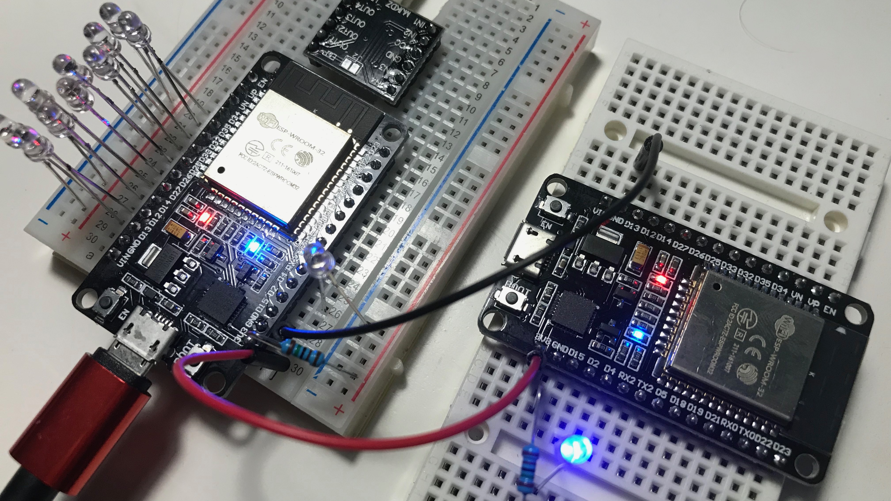

# ESP32 projects

We had several Arduino Uno projects at our school. But soon you want to add some bluetooth or WiFi functionality to your project. You need another module, library, cable and so on. Why not use the ESP32 that has all that out of the box? And much more RAM and storage for data and all kinds of projects? That's why it's here. Let's start simple.

### [Visit the Wiki](https://github.com/kreier/ESP32/wiki)!

## Blink
Unlike the Arduino the build-in LED is not connected to pin 13, but pin 2. Everything else is the same. Once it blinks you know that the module works, you can upload stuff and you have a simple output signal for further experiments. If you use the board "**DOIT ESP32 DEVKIT V1**" you can use the "**File > Examples > 01.Basics > Blink** out of the box.

## BLE with iPhone remote
Bluetooth Low Energy BLE is a little more complicated than Bluetooth 2.0. The ESP can do both, and the serial connection with an ESP32 is pretty straight forward. Comparable with a HC-05.

BLE is a little more complicated, because there are services, characteristics, descriptors, properties, values and several of them with their own UUID. Using nRF Connect, BLE Scanner and LightBlue it was easy to connect to the ESP with the build-in examples. But I wanted to use the remote app GoBLE. More in the [Wiki](https://github.com/kreier/ESP32/wiki).
